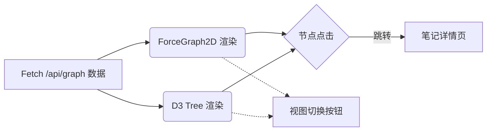

# 执行摘要
**数字花园3.0**的目标是让这个小众的个人知识空间继续生长，而不是变成“大厂级”产品。我们只为自己和少数用户做优化，重点放在“笔记之间真正连起来”与“聪明的AI伙伴”上。具体而言，3.0 将优先打通笔记内部和笔记之间的链接关系（包括反向链接和块引用），让整个笔记体系像一张可浏览的知识网络；其次开发一个简单实用的交互式AI助手，帮助查询笔记、推荐关联和提醒；再者改善主题UI和性能，让系统更稳定流畅。下文将给出面向单人开发的实施方案：包括数据模型、数据库与API设计、前端组件、关联图谱页面实现方案、AI伴侣功能规划、性能调优措施、实施里程碑和示例提示词等，可直接喂给 Claude Code/DeepSeek 执行。

## 项目定位与约束
- **开发模式**：单人开发，由开发者本人设计和编码，AI 作为辅助工具（建议使用 VS Code + Claude Code + DeepSeek）。没有正式团队协作流程。  
- **用户规模**：面向自己和少数先行用户（可邀请好友试用），不追求大规模或公众用户。  
- **商业属性**：个人项目，无商业化目标。核心需求来自个人使用体验，功能设计以实用为主，不考虑营销、盈利或企业级要求。  
- **资源/时间/技术**：无特定外部经费或时间压力，可随性迭代。技术选型以自己熟悉的栈为主（Next.js、React、Prisma、SQLite、Tailwind 等）。  
- **其他约束**：保持系统轻量，避免过度复杂。尽量使用现有代码结构，只增不拆（针对旧功能的临时兼容模式可使用可选开关）。不追求过度泛化的功能，优先满足个人知识管理需求。

## 核心目标（优先级）
1. **笔记重构与内部链接** – 重新整理现有笔记，拆成块（block），并补全内部跨笔记链接和页内链接，形成基本的知识网络。  
2. **反向链接与块引用** – 实现自动反向链接（Backlink）和块级引用功能，使每条笔记都能展示引用它的其他笔记，支持引用笔记中具体内容块。  
3. **关联图谱页面（星网+世界树）** – 新增一个关联可视化页面，可切换 “星型图”(force-directed graph) 和 “世界树”(hierarchical tree) 两种视图，展示笔记节点及其相互关系。  
4. **交互式AI伴侣** – 一个简单的聊天式界面，能记忆对话、主动提醒、基于关联图推荐相关笔记、支持自然语言查询和自动补链建议。  
5. **主题UI优化** – 在保证原有界面风格的基础上，优化一些交互细节和视觉，增强个性化（如调整配色、背景等），提升使用舒适度。  
6. **性能优化** – 修复开发模式内存泄漏、优化图谱渲染效率、数据库访问节流等，确保3.0功能上线后系统依然流畅稳定。  

## 关联体系设计方案

### 数据模型与数据库设计  
- **User**（用户，可选）：虽然是个人项目，可预留多人支持。可选字段：`id (UUID)`、`name`、`avatar`等。默认单人使用可简化，仅用作未来拓展。  
- **Note**（笔记）：每条笔记记录。字段如`id (UUID)`, `title`, `content` (全文Markdown)，`createdAt`, `updatedAt`等。  
- **Block**（块单元）：拆分自Note的子内容单元。每条Block包含`id (Int 自增)`, `noteId (外键关联Note)`, `content`（该块的文本，可含Markdown链接等），`order`（顺序）等。这样可以对笔记内容进行粒度引用和关联。  
- **Link**（链接/关联）：记录笔记之间的引用关系。可设计为：`id (Int 自增)`, `fromBlockId`（引用所在的块，外键可选），`toNoteId`（目标笔记id） , `relationType`（枚举，如“internal”、”block_ref“、”image_embed“ 等），`createdAt`等。 
  - 当用户在块中插入内链`[[目标笔记]]`时，会创建一条Link，`fromBlockId`指向当前块，`toNoteId`为目标笔记。`relationType`可标记为“InternalLink”。
  - 如果支持跨笔记引用某个块（例如Obsidian-style块引用），可以再加个字段`toBlockId`，或者把目标Block作为一个特殊类型的Link。  
- **RelationType/Metadata**：可以额外设计“关系类型表”或使用枚举，区分“普通内链”、“块引用”、“标签关联”(可选)、”主题关系“等。也可在Link表上简单存枚举。  
- **Tags/Themes**（可选）：如果需要，可设计Tag或Theme表，把笔记归类，但关联体系核心依赖于Link，标签可以作为辅助。  

典型的实体关系图（示意）：

```mermaid
erDiagram
    USER ||--o{ NOTE : "拥有"
    NOTE ||--|{ BLOCK : "包含"
    NOTE ||--o{ LINK : "源于"
    NOTE ||--o{ LINK : "目标"
    BLOCK ||--o{ LINK : "发出"
    NOTE {
        id UUID PK
        title String
        content Markdown
        createdAt DateTime
        updatedAt DateTime
    }
    BLOCK {
        id Int PK
        noteId UUID FK
        content Markdown
        order Int
    }
    LINK {
        id Int PK
        fromBlockId Int FK
        toNoteId UUID FK
        toBlockId Int FK (optional)
        type String
        createdAt DateTime
    }
```

### 数据库/Prisma Schema 建议  
使用 Prisma ORM，SQLite 或 PostgreSQL。示例 Prisma Schema 片段：

```prisma
model Note {
  id        String   @id @default(uuid())
  title     String
  content   String
  createdAt DateTime @default(now())
  updatedAt DateTime @updatedAt

  blocks    Block[]
  linksFrom Link[]    @relation("LinksFrom")
  linksTo   Link[]    @relation("LinksTo", fields: [id], references: [toNoteId])
}

model Block {
  id      Int    @id @default(autoincrement())
  note    Note   @relation(fields: [noteId], references: [id])
  noteId  String
  content String
  order   Int

  links    Link[] @relation("LinksFrom", fields: [id], references: [fromBlockId])
}

model Link {
  id          Int     @id @default(autoincrement())
  fromBlock   Block?  @relation("LinksFrom", fields: [fromBlockId], references: [id])
  fromBlockId Int?
  toNote      Note    @relation("LinksTo", fields: [toNoteId], references: [id])
  toNoteId    String
  toBlockId   Int?    // 如果支持块级引用，可关联目标块
  type        String  // e.g. "internal", "block_ref"
  createdAt   DateTime @default(now())
}
```

> **提示**：Prisma 官方文档对**关系模型**有详细说明。上述设计使用了1对多关联（一个Note多个Block，一个Note多个Link等），以及可选的一对一（块引用时）。请根据需要添加字段（如所属用户）和约束。

### API/Server Action 端点清单  
使用 Next.js 的 API 路由或 Server Actions 处理数据操作。关键端点示例：

- `GET /api/notes`：获取笔记列表（可带查询参数过滤）。  
- `GET /api/notes/[id]`：获取指定笔记详情（包括内容和已拆分的Block列表）。  
- `POST /api/notes`：创建新笔记（带初始内容）。  
- `PATCH /api/notes/[id]`：更新笔记标题/内容（必要时可拆解并重建Blocks）。  
- `DELETE /api/notes/[id]`：删除笔记（级联删除相关Blocks和Links）。  

- `POST /api/links`：创建新Link。请求体可包含`fromBlockId`, `toNoteId`, `toBlockId`, `type`等，由前端在用户创建链接时调用。  
- `GET /api/notes/[id]/linksFrom`：获取某笔记中每个Block发出的所有Link（用于显示笔记内部的“引用了哪些笔记”）。  
- `GET /api/notes/[id]/linksTo`：获取指向某笔记的所有Link（用于反向链接列表）。  
- `GET /api/graph`：返回所有笔记及其Link关系的完整数据（或增量数据），用于图谱页面渲染。  
- **提示**：可以考虑使用 Next.js 13 的 Server Actions 或 API Route 直接调用 Prisma 进行数据库操作。

### 前端组件与页面清单  
- **笔记编辑/详情页**（NotePage）：显示笔记标题、内容块等。内嵌一个编辑器组件（可使用现有编辑器，例如Markdown编辑器），并监听用户创建内链（如输入`[[`后弹出提示）。每个块末尾显示“引用此处的笔记”或“被引用次数”信息。
- **块组件**（BlockComponent）：代表笔记中的一个内容块，便于独立更新。  
- **链接展示组件**：如“引用笔记列表”（来自 linksFrom）和“被引用笔记列表”（来自 linksTo）。可放在笔记页底部或侧边。  
- **关联图谱页**（GraphPage）：一个新页面，负责显示整个笔记关系图。内部可包含两个子组件：**星网视图**（ForceGraphView）和**世界树视图**（TreeView），并带有模式切换按钮。  
- **AI伴侣页/组件**（ChatPage）：一个简单聊天界面（可暂做对话框+输入框），由前端显示，并通过 API 调用聊天后端（Claude Code或类似）处理用户指令。  
- **主题设置/Sidebar**（可选）：UI层面细节如深色模式切换、字体大小、背景配置等。不是核心功能，但可以列在里程碑中做小优化。

### 交互流程示意
1. **创建内部链接**：用户在编辑笔记时插入 `[[目标笔记标题]]`（编辑器可监听 `[[` 触发自动补全笔记名）。确认后，前端调用 `POST /api/links`，传入当前块ID和目标笔记ID，服务器保存 Link。界面上同时显示该块包含的链接（可高亮或列表）。  
2. **生成反向链接**：在笔记详情的底部或侧栏，自动显示所有指向当前笔记的Link（即后端用 `linksTo` 查询）。用户点击其中一个可跳转到源笔记。**无需人工干预**，反向链接由数据库查询或触发器式逻辑自动提供。  
3. **块级引用**：如果允许用户引用某一具体块（如Obsidian的block reference），前端提供块地址（例如 `^blockId`），然后创建 Link 时填充 `toBlockId`。显示时可将引用片段定位到对应块。  
4. **数据导出/同步**：为了绘制图谱，可提供一个后台作业或API `GET /api/graph`，返回 `{ nodes: [ { id, title, type }, ... ], edges: [ { from, to, type }, ... ] }`。前端GraphPage每次加载时调用此接口。更新笔记时也可以触发部分刷新或重新生成图数据。  
5. **验证与测试用例**：  
   - *单元测试*：对每个API端点编写测试，例如使用 Jest + Supertest 验证创建链接后数据库记录正确；测试反向链接查询是否列出所有来源。  
   - *集成测试*：如用 Playwright 或 Puppeteer 自动化模拟“编辑笔记，插入[[链接]]，保存；打开目标笔记，检查是否有反向链接。”  
   - *手动测试*：完成基础功能后，应手动验证：笔记之间能相互链接，链接后可以跨笔记引用块并返回，前端显示符合预期。确保删除笔记时相关Link被清理。  

## 关联图谱页面技术方案

### 技术选型  
- **星网图（Force-Directed Graph）**：推荐使用 [`react-force-graph`](https://github.com/vasturiano/react-force-graph) 库（2D画布版本）。它基于 d3-force，可快速可视化节点和关系，支持放缩和拖拽。也可选用 D3 本身的 `d3-force` 实现，但需要手动管理canvas或SVG。`react-force-graph`对React友好。  
- **世界树（树形图）**：可以考虑使用 [d3-hierarchy](https://observablehq.com/@d3/hierarchy) 构建树状图，或者基于 `vis.js` 的网络图 (vis-network) 实现树图结构。对于有明显层级结构（如主题->子主题），树状图更直观。由于笔记可能存在多条主线，可人为定义“根节点”（如“我的笔记”）将所有笔记挂到一个虚拟根下，构建单棵大树。  
- **双模式切换**：在 GraphPage 提供两个按钮切换当前视图类型（星网 vs 树），并在两者之间共享数据源。不要重新拉数据，只切换渲染组件。  
- **大数据量处理**：如果笔记和链接数较多，可采用**分层加载**（比如只渲染最近1-2层关系，用户可放大查看全局）或**聚合节点**（将同类别节点先合并显示）。可以预设一个最大节点数，如1000节点以上时分批加载。缩放时动态增删节点，提高性能。  
- **交互功能**：两种图都支持：鼠标拖拽缩放，节点点击弹窗显示笔记标题和摘要，可点击跳转到笔记详情；高亮选中节点及其邻居；搜索节点时居中并高亮等。  
- **可视风格**：简单清晰为主，节点大小可按重要性（如链接数）或类型（主题/笔记/用户）。边线颜色或粗细可按类型区分（参考哪些笔记互联）。

### 实现步骤（分步修改策略）  
> 每步**只修改一个文件**，避免一次改动过多产生上下文混淆。

1. **设计数据接口**：新增 `GET /api/graph` API 路由。**只修改一个文件**：`pages/api/graph.ts`。实现：查询数据库所有Notes和Links，输出符合前端需要的JSON结构。完成后可测试API输出。  
2. **创建GraphPage页面**：新增 `pages/graph.tsx` 文件。实现界面布局和模式切换控件（比如两个按钮 `[星图] [树图]`）。暂时填充假数据或空容器。  
3. **实现星网图视图**：在GraphPage中引入 `react-force-graph`。**修改GraphPage.tsx**：使用 `useEffect` 调用 `/api/graph`，将数据传给 `ForceGraph2D` 组件渲染。调试确保能看到简单节点和边。  
4. **实现点击跳转**：在 ForceGraph 的 `onNodeClick` 事件中，调用 `router.push('/notes/'+node.id)` 跳转到对应笔记详情页。**修改GraphPage.tsx**部分代码。  
5. **添加树形图视图**：新增一个 TreeView 组件文件 `components/GraphTree.tsx`（或在GraphPage同文件）。使用 D3 或 vis.js 构建树图。**修改GraphPage.tsx**：切换时渲染TreeView。初期可先用简单ul列表模拟层次结构，再逐步替换为可视化组件。  
6. **模式切换逻辑**：在`GraphPage.tsx`中实现状态管理 (`useState`) 记录当前模式（`isTreeView`）。按钮点击切换该状态。根据状态条件渲染 ForceGraph 或 TreeView。**修改GraphPage.tsx**。  
7. **性能优化**：如果节点多，可在 `GraphPage.tsx` 中对数据进行切片或阈值限制渲染。例如只渲染主线笔记，当用户缩放到一定程度时再加载次级节点。也可以使用 `react-force-graph` 提供的 `nodeAutoColorBy`、`dagMode` 等属性提升布局性能。**修改GraphPage.tsx**。  
8. **可配置选项**：可添加右上角控制面板（单独组件），让用户选择要显示的笔记类型、过滤或聚合层级。这步可放在后期迭代。  


*图：关联图谱页面渲染流程示意（星网图 & 世界树切换）*

> **参考**：`react-force-graph` 官方文档和示例。请参阅其API说明（如`<ForceGraph2D graphData={...} />`），以及 D3 的 `d3-hierarchy` 用法说明。

## AI伴侣功能与实现方案

### 功能清单
- **对话界面**：一个基础聊天UI，用户可输入文字或命令与AI互动（例如在专门的“AI助手”页面）。  
- **记忆**：区分*会话记忆*（当前对话上下文）和*长期记忆*。会话记忆可暂存在前端或会话状态中；长期记忆则指AI对用户重要信息的记录，例如偏好、重点主题等，可存入数据库（如专门的Memory表或使用现有Note存档）。  
- **主动提醒**：根据笔记内容（如含有日期、待办等关键词）或使用者习惯，AI可定时或条件触发提醒。例如：每天早上提醒查看待办事项、提醒复习一周前写的笔记。可以通过设置简单的触发规则实现。  
- **关联推荐**：基于关联图的推荐功能：当用户打开或询问某个笔记时，AI列出与之直接相关的笔记，以及主题相近的笔记。可通过查询 `linksFrom` 和 `linksTo` 获得直接邻居，或简单的内容相似度（可选）。  
- **自然语言查询**：允许用户用自由文本询问笔记内容。如“帮我找到关于React Hooks的笔记”、“哪个笔记提到了 AI 伴侣？”等。AI解析后自动搜索笔记标题和内容，将相关笔记链接或摘要返回。  
- **自动补链建议**：当用户编辑笔记时，AI可分析文本并建议可能的内部链接。例如，“你写到X项目了，可能可以链接到[[X项目总结]]”。这类似于Obsidian的“发现未链接提及”。可以将笔记内容发送给后端AI模型，让其返回推荐链接列表。  
- **示例对话**：  
  - 用户：*“我记得有篇笔记提到过AI聊天，但叫什么来着？”*  AI：*“你可能指的是《AI笔记助手》那篇，内容涉及实时会议记录和笔记整理。”*  
  - 用户：*“帮我联系昨天写的‘会议记录’和现有的相关笔记。”* AI：*“已为《会议记录》笔记添加了以下建议链接：[[项目进度]]、[[待办清单]]。”*  
  - 用户：*“现在几点了？顺便给我提醒下午有写代码任务。”* AI：*“当前时间14:00，你下午3点有“写代码”任务提醒，已加入提醒列表。”*  

### 实现方案  
- **聊天框架**：前端可使用现有组件库或自行用React构建一个简单聊天布局。每条消息发送时触发一个后端API请求。  
- **AI模型选择**：无特定约束，可以使用本地小模型（如Claude Code本地部署）或云API（如Claude API、OpenAI）。建议先用已有AI平台接口，后期可考虑自托管。  
- **后端流程**：创建一个`/api/chat`端点，前端发送用户消息和会话ID到后端。后端负责：  
  1. **上下文管理**：维护会话历史（可存内存或数据库），供AI生成响应使用。  
  2. **记忆更新**：根据对话内容（如用户明示记忆点：“AI，我下周去上海，要帮我记下”），自动生成结构化记忆条目（如`Reminders`表）保存。  
  3. **任务**：接收自然语言指令，判断是否需要调用特定逻辑（如创建提醒、搜索笔记），否则直接作为一般聊天提问发送给AI模型。  
- **权限与隐私**：因为是本地/个人项目，不涉及第三方隐私敏感数据，只需保证对话内容安全。默认存储在本地数据库中即可，不必复杂安全策略。  
- **示例触发点**：在笔记详情页添加“让AI推荐关联”按钮，点击时自动发送当前笔记标题/ID让AI分析关联；或者在聊天页面直接提示“列出最近编辑的笔记链接”。  

> **提示**：可以参考Notion等产品的“Ai Helper”功能思路。核心在于设计与笔记数据库相连的后端逻辑，而非仅靠模型对话。

## 性能与稳定性策略

- **开发模式**：为避免内存泄漏，建议：  
  - 清理 `.next` 缓存 (`rm -rf .next`) 后重启 `npm run dev`，确保编译无旧残留。  
  - 在 `next.config.js` 中禁用对大型资源目录的监视（如 `webpack.watchOptions.ignored = /resource_off/` 等），防止自动重新编译触发。  
  - 如遇频繁热重载，可临时关闭 Turbopack 或切换到 Webpack 模式调试。  
- **生产构建**：在部署前检查 `package.json` 中无开发依赖遗漏，`.gitignore`排除敏感和巨型文件（`node_modules/`, `resource/`等）。测试 `npm run build` 确认无错误。
- **图谱渲染优化**：`react-force-graph` 可以通过设置 `d3AlphaDecay`、`nodeRelSize` 等参数控制布局迭代和节点尺寸；大图时可启用 `dagMode: 'hubsize'` 或类似布局减少重叠。若节点数 >500，可考虑 WebGL 渲染（react-force-graph-3d）或局部加载。
- **数据库访问节流**：避免在短时间内发起大量读写。对于频繁查询（如反向链接列表），可加简单缓存（前端缓存或服务器内存）。Prisma 本身有连接池配置，可按官方文档调整。
- **Prisma/SQLite 注意**：SQLite在高并发下写入会阻塞，虽单人项目影响小，但多个异步写操作需使用事务。Prisma日志可开启查看慢查询。部署时切换到 Postgres 亦可考虑。
- **定期重启**：如果是长时间运行的桌面应用，建议偶尔重启开发服务器清理内存。

## 实施里程碑

| 里程碑             | 预期产出                                 | 负责人      | 估算工时 | 验收标准                                   |
|------------------|--------------------------------------|----------|-------|----------------------------------------|
| 数据模型 & 链接API   | 完成Prisma schema和基本API接口（notes、links等）。    | 我/AI    | 4h    | 能通过后端手动创建笔记和链接并查询。            |
| 笔记重构 & 链接展示  | 现有笔记拆成块，前端新增内部链接编辑及反向链接UI。   | AI/我    | 6h    | 编辑笔记可插入`[[链接]]`并看到目标笔记的反向链接。 |
| 关联图谱基础 (星网)| 新增GraphPage，能显示全笔记ForceGraph，节点可点跳。 | AI      | 5h    | 图谱可展示节点和边，点击节点跳转笔记页面。        |
| 关联图谱(世界树)   | 在GraphPage中实现Tree视图切换并展示层级关系。     | AI      | 5h    | 切换到树图时，能按层级展开笔记树状结构。         |
| AI伴侣基础对话     | 实现聊天页面与后端链接，能正常往返消息。         | 我/AI    | 4h    | 聊天UI可输入问题，后端返回回应并显示。           |
| AI推荐功能        | AI能基于当前笔记返回相关笔记列表。            | AI/DeepSeek | 6h    | 输入笔记ID调API，返回推荐的关联笔记清单。       |
| UI & 主题调整      | 微调界面主题、背景、字体等视觉元素。         | 我      | 3h    | 界面美观度提升，无功能破坏。               |
| 性能调优          | 清理.dev内存泄漏，调整图谱性能、DB索引优化。      | 我      | 4h    | `npm run dev`在正常占用下无快速增长，构建无警告。  |
| 文档&测试         | 补充注释、README，撰写测试用例，完善教程。       | 我      | 3h    | 文档完整，基本测试通过，用例详尽。            |

## 任务首条提示词示例

- **关联体系：**  
  > “请列出现有笔记中含有`[[`但没有闭合链接的段落，或者常见可加内部链接的关键词。输出格式：问题列表。”  
  *预期输出：找到的潜在链接提示列表，以待人工确认和补充。*

- **图谱页面 (星网):**  
  > “请在`pages/graph.tsx`中新建一个空页面，包含切换按钮和一个`<ForceGraph2D>`组件（暂不挂数据），并确保页面可以访问到`/api/graph`。”  
  *预期输出：修改文件名+补丁，创建GraphPage并基本渲染布局。*  

- **AI伴侣 (对话基础):**  
  > “在`pages/chat.tsx`创建一个简单聊天页面，包含消息显示列表和输入框。实现发送消息到`/api/chat`后端并显示返回结果。”  
  *预期输出：新增文件`chat.tsx`代码片段，前后端连通示例。*  

- **性能优化 (监测):**  
  > “请检查`next.config.js`中对大型文件夹的监视配置，禁用对`resource`目录的watch。报告发现并给出修改方案。”  
  *预期输出：问题列表+修改方案（如注释规则示例）。*  

每个任务后续可分别继续编写详细实现提示。上述示例提示词清晰简洁，只着眼于单一目标，易于 Claude Code/DeepSeek 执行。
